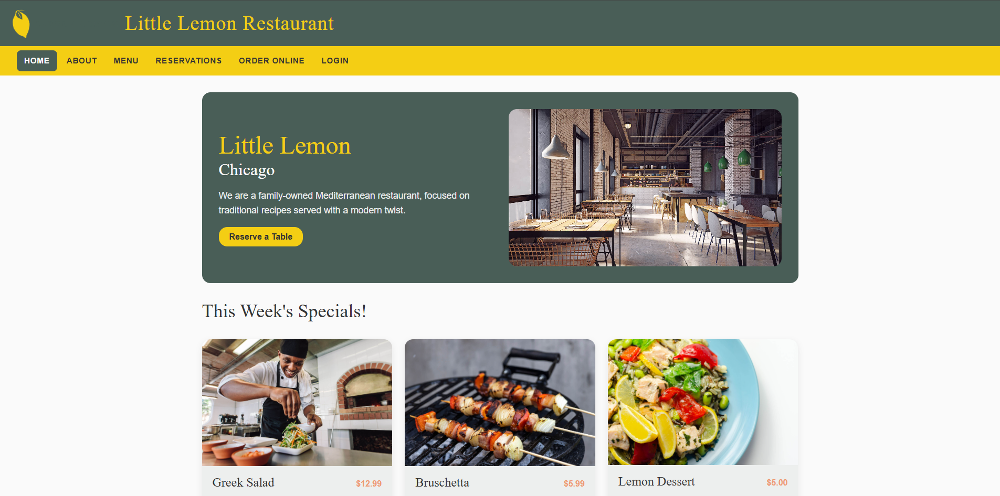
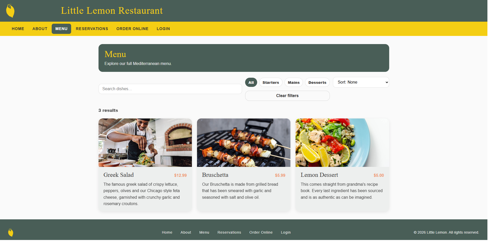
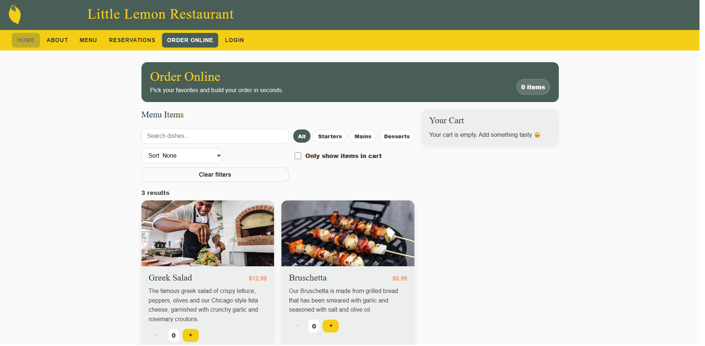
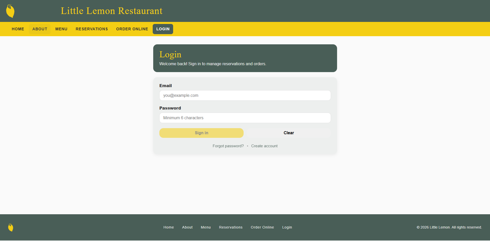
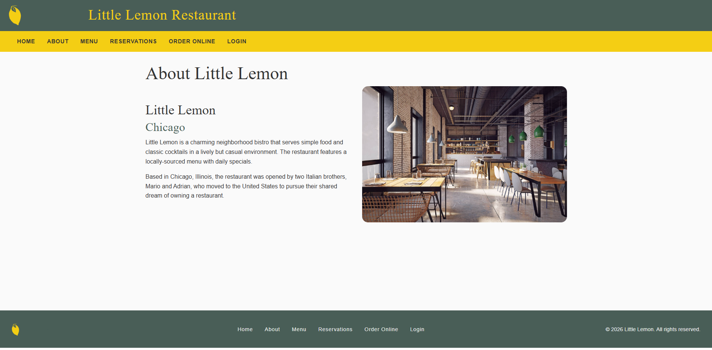

<p align="right">
  <a href="README_EN.md">🇬🇧 English</a>
</p>

<h1 align="center">🍋 Little Lemon Restaurant</h1>

<p align="center">
  Modern Multi-Page Restaurant Reservation Application
</p>

<p align="center">
  <a href="https://little-lemon-restaurant-app-olive.vercel.app">
    
  </a>
  
  
  
</p>

---

## 📌 Proje Özeti

Little Lemon, React ve Vite kullanılarak geliştirilmiş modern bir restoran rezervasyon uygulamasıdır.

Bu proje aşağıdaki React konseptlerini göstermektedir:

- Client-side routing (React Router)
- useReducer ile state yönetimi
- Controlled form bileşenleri
- Dinamik form validasyonu
- Çok sayfalı SPA mimarisi
- Jest & React Testing Library ile unit test

---

## 🌐 Canlı Demo

<p align="center">
  <a href="https://little-lemon-restaurant-app-olive.vercel.app">
    
  </a>
</p>

---

## 📸 Ekran Görüntüleri

### 🏠 Ana Sayfa
<p align="center">
  
</p>

### 🍽 Menü & Sipariş
<p align="center">
  
  
</p>

### 📅 Rezervasyon
<p align="center">
  
</p>

### 🔐 Giriş & Hakkında
<p align="center">
  
  
</p>

---

## 🧠 Teknik Kararlar

### 🔹 Neden useReducer?
Rezervasyon saatlerinin dinamik olarak güncellenmesi için state geçişlerini daha öngörülebilir hale getirmek amacıyla useReducer tercih edilmiştir.

### 🔹 Neden Vite?
- Daha hızlı development server
- Daha optimize build çıktısı
- Modern ES module desteği

### 🔹 Routing Yapısı
React Router kullanılarak SPA mimarisi kurulmuş ve sayfa yenilemelerinde Vercel rewrite kuralı ile 404 problemi çözülmüştür.

---

## 🛠 Kullanılan Teknolojiler

- React
- Vite
- React Router
- JavaScript (ES6+)
- CSS
- Jest
- React Testing Library
- Vercel (Deployment)

---

## 🚀 Kurulum

```bash
git clone https://github.com/your-username/little-lemon-restaurant-app.git
cd little-lemon-restaurant-app
npm install
npm run dev
```

Uygulama:
```
http://localhost:5173
```

---

## 🧪 Testler

```bash
npm test
```

---

## 📦 Deployment

Bu proje Vercel üzerinde deploy edilmiştir.

Her `git push` sonrası otomatik production deployment yapılmaktadır.

---

## 👨‍💻 Geliştirici

**Emir Mağrul**

---
